# iosMath Examples

## Square of sums
```LaTeX
(a_1 + a_2)^2 = a_1^2 + 2a_1a_2 + a_2^2
```

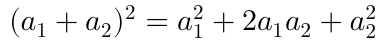

## Quadratic Formula
```LaTeX
x = \frac{-b \pm \sqrt{b^2-4ac}}{2a}
```


## Standard Deviation
```LaTeX
\sigma = \sqrt{\frac{1}{N}\sum_{i=1}^N (x_i - \mu)^2}
```
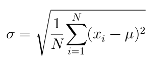

## De Morgan's laws
```LaTeX
\neg(P\land Q) \iff (\neg P)\lor(\neg Q)
```

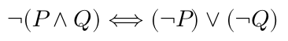

## Log Change of Base
```LaTeX
\log_b(x) = \frac{\log_a(x)}{\log_a(b)}
```

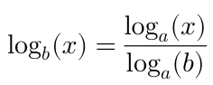

## Cosine addition
```LaTeX
\cos(\theta + \varphi) = \cos(\theta)\cos(\varphi) - \sin(\theta)\sin(\varphi)
```

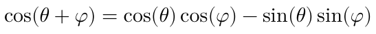

## Limit e^k
```LaTeX
\lim_{x\to\infty}\left(1 + \frac{k}{x}\right)^x = e^k
```

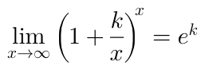

## Calculus
```LaTeX
f(x) = \int\limits_{-\infty}^\infty\!\hat f(\xi)\,e^{2 \pi i \xi x}\,\mathrm{d}\xi
```


## Stirling Numbers of the Second Kind
```LaTeX
{n \brace k} = \frac{1}{k!}\sum_{j=0}^k (-1)^{k-j}\binom{k}{j}(k-j)^n
```

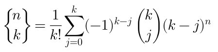

## Gaussian Integral
```LaTeX
\int_{-\infty}^{\infty} \! e^{-x^2} dx = \sqrt{\pi}
```

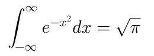

## Arithmetic mean, geometric mean inequality
```LaTeX
\frac{1}{n}\sum_{i=1}^{n}x_i \geq \sqrt[n]{\prod_{i=1}^{n}x_i}
```


## Cauchy-Schwarz inequality
```LaTeX
\left(\sum_{k=1}^n a_k b_k \right)^2 \le \left(\sum_{k=1}^n a_k^2\right)\left(\sum_{k=1}^n b_k^2\right)
```
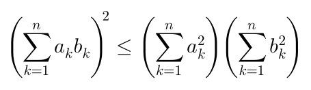

## Cauchy integral formula
```LaTeX
f^{(n)}(z_0) = \frac{n!}{2\pi i}\oint_\gamma\frac{f(z)}{(z-z_0)^{n+1}}dz
```

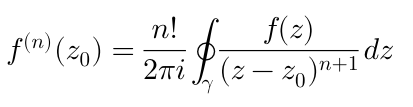
## Schroedinger's Equation
```LaTeX
i\hbar\frac{\partial}{\partial t}\mathbf\Psi(\mathbf{x},t) = -\frac{\hbar}{2m}\nabla^2\mathbf\Psi(\mathbf{x},t)
+ V(\mathbf{x})\mathbf\Psi(\mathbf{x},t)
```

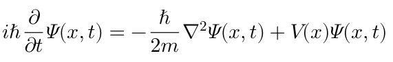

## Lorentz Equations
Use the `gather` or `displaylines` environments to center multiple
equations.
```LaTeX
\begin{gather}
\dot{x} = \sigma(y-x) \\
\dot{y} = \rho x - y - xz \\
\dot{z} = -\beta z + xy"
\end{gather}
```

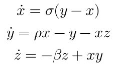

## Cross product
```LaTeX
\vec \bf V_1 \times \vec \bf V_2 =  \begin{vmatrix}
\hat \imath &\hat \jmath &\hat k \\
\frac{\partial X}{\partial u} & \frac{\partial Y}{\partial u} & 0 \\
\frac{\partial X}{\partial v} & \frac{\partial Y}{\partial v} & 0
\end{vmatrix}
```

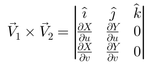

## Maxwell's Equations
Use the `aligned`, `eqalign` or `split` environments to align
multiple equations.
```LaTeX
\begin{eqalign}
\nabla \cdot \vec{\bf E} & = \frac {\rho} {\varepsilon_0} \\
\nabla \cdot \vec{\bf B} & = 0 \\
\nabla \times \vec{\bf E} &= - \frac{\partial\vec{\bf B}}{\partial t} \\
\nabla \times \vec{\bf B} & = \mu_0\vec{\bf J} + \mu_0\varepsilon_0 \frac{\partial\vec{\bf E}}{\partial t}
\end{eqalign}
```

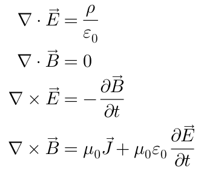

## Matrix multiplication
Supported matrix environments: `matrix`, `pmatrix`, `bmatrix`, `Bmatrix`,
`vmatrix`, `Vmatrix`.
```LaTeX
\begin{pmatrix}
a & b\\ c & d
\end{pmatrix}
\begin{pmatrix}
\alpha & \beta \\ \gamma & \delta
\end{pmatrix} = 
\begin{pmatrix}
a\alpha + b\gamma & a\beta + b \delta \\
c\alpha + d\gamma & c\beta + d \delta 
\end{pmatrix}
```

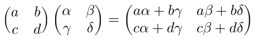

## Cases
```LaTeX
f(x) = \begin{cases}
\frac{e^x}{2} & x \geq 0 \\
1 & x < 0
\end{cases}
```

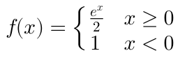

## Splitting long equations
```LaTeX
\frak Q(\lambda,\hat{\lambda}) =
-\frac{1}{2} \mathbb P(O \mid \lambda ) \sum_s \sum_m \sum_t \gamma_m^{(s)} (t) +\\
\quad \left( \log(2 \pi ) + \log \left| \cal C_m^{(s)} \right| +
\left( o_t - \hat{\mu}_m^{(s)} \right) ^T \cal C_m^{(s)-1} \right) 
```

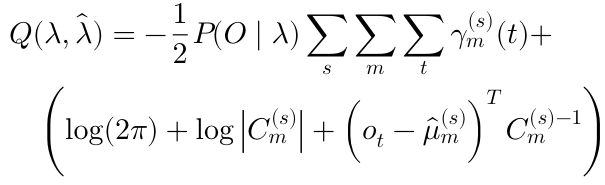
