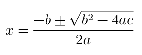
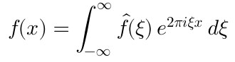
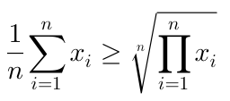
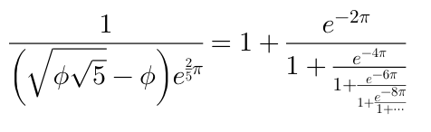

# iosMath

[](./LICENSE)

`iosMath` is a library for displaying beautifully rendered math equations
in iOS and macOS applications. It typesets formulae written using LaTeX in
a `UIView`/`NSView` subclass, using the same typesetting rules as TeX so
equations look exactly as LaTeX would render them — no WebView required.

It is similar to [MathJax](https://www.mathjax.org) or
[KaTeX](https://github.com/Khan/KaTeX) for the web but for native iOS or
macOS applications, and significantly faster than a `UIWebView`.

## Examples









The [EXAMPLES.md](./EXAMPLES.md) file contains more examples.

## Requirements

`iosMath` requires **iOS 18+** or **macOS 15+**. It depends on the following
Apple frameworks: Foundation, CoreGraphics, QuartzCore, CoreText, and
UIKit (iOS) or AppKit (macOS).

## Installation

iosMath is distributed via **Swift Package Manager**.

**In Xcode:** File → Add Package Dependencies… and enter the repository URL.

**In `Package.swift`:**

```swift
dependencies: [
    .package(url: "https://github.com/kostub/iosMath.git", from: "2.1.0"),
],
targets: [
    .target(
        name: "YourTarget",
        dependencies: ["iosMath"]
    ),
]
```


## Usage

### Simple usage — UIKit / AppKit

Create an `MTMathUILabel`, set its `latex` property, and add it as a subview:

```swift
import iosMath

let label = MTMathUILabel()
label.latex = #"x = \frac{-b \pm \sqrt{b^2-4ac}}{2a}"#
view.addSubview(label)
```

<details>
<summary>Objective-C</summary>

```objective-c
@import iosMath;

MTMathUILabel *label = [[MTMathUILabel alloc] init];
label.latex = @"x = \\frac{-b \\pm \\sqrt{b^2-4ac}}{2a}";
[self.view addSubview:label];
```

</details>

### Simple usage — SwiftUI

`MTMathUILabel` is a `UIView`/`NSView` subclass. Wrap it for SwiftUI using
`UIViewRepresentable` / `NSViewRepresentable`:

```swift
import SwiftUI
import iosMath

#if os(iOS)
struct MathView: UIViewRepresentable {
    let latex: String
    func makeUIView(context: Context) -> MTMathUILabel { MTMathUILabel() }
    func updateUIView(_ view: MTMathUILabel, context: Context) {
        view.latex = latex
    }
}
#elseif os(macOS)
struct MathView: NSViewRepresentable {
    let latex: String
    func makeNSView(context: Context) -> MTMathUILabel { MTMathUILabel() }
    func updateNSView(_ view: MTMathUILabel, context: Context) {
        view.latex = latex
    }
}
#endif
```

Then use it in any SwiftUI view:

```swift
MathView(latex: #"e^{i\pi} + 1 = 0"#)
    .frame(height: 50)
```

A complete cross-platform SwiftUI wrapper with font, color, and alignment
support is available in [`SwiftMathExample/MathLabel.swift`](SwiftMathExample/MathLabel.swift).

### Supported formula types

* Simple algebraic equations
* Fractions and continued fractions
* Exponents and subscripts
* Trigonometric formulae
* Square roots and n-th roots
* Calculus symbols — limits, derivatives, integrals
* Big operators (e.g. product, sum)
* Big delimiters (using `\left` and `\right`)
* Greek alphabet
* Combinatorics (`\binom`, `\choose` etc.)
* Geometry symbols (e.g. angle, congruence etc.)
* Ratios, proportions, percents
* Math spacing
* Overline and underline
* Math accents
* Matrices
* Equation alignment
* Bold, roman, caligraphic and other font styles (`\bf`, `\text`, etc.)
* Most commonly used math symbols
* Colors

### Example app

A runnable Swift example app is in [`SwiftMathExample/`](SwiftMathExample/).
It has two tabs: a curated **Examples** tab showing named formulae, and a
**Gallery** tab with the full rendering test suite.

Open `SwiftMathExample.xcodeproj` in Xcode, or build from the command line:

```
xcodebuild build -project SwiftMathExample.xcodeproj \
  -scheme SwiftMathExample \
  -sdk iphonesimulator \
  -destination 'platform=iOS Simulator,name=iPhone 16'
```

## Advanced configuration

### Math mode

`MTMathUILabel` supports Display mode (equivalent to `$$` in LaTeX) and Text
mode (equivalent to `$`). The default is Display. To switch:

```swift
label.mode = .text
```

<details>
<summary>Objective-C</summary>

```objective-c
label.labelMode = kMTMathUILabelModeText;
```

</details>

### Text alignment

The default alignment is left. To center or right-align:

```swift
label.textAlignment = .center
```

<details>
<summary>Objective-C</summary>

```objective-c
label.textAlignment = kMTTextAlignmentCenter;
```

</details>

### Font size

The default font size is 20pt:

```swift
label.fontSize = 30
```

### Font

The default font is *Latin Modern Math*. Three fonts are bundled; you can
also use any OTF math font:

```swift
label.font = MTFontManager().termesFont(withSize: 20)
```

<details>
<summary>Objective-C</summary>

```objective-c
label.font = [[MTFontManager fontManager] termesFontWithSize:20];
```

</details>

### Color

```swift
label.textColor = .red
```

To change the color of individual parts of the equation, access
`label.displayList` and set `textColor` on the specific display nodes.

<details>
<summary>Objective-C</summary>

```objective-c
label.textColor = [UIColor redColor];
```

</details>

### Content insets

Content insets add padding between the rendered equation and the edges of the
label's bounds. This is useful when the label sits flush against other elements
and you need breathing room without adding a wrapper view:

```swift
// Add 10 pt of space on the left and 20 pt on the right.
label.contentInsets = UIEdgeInsets(top: 0, left: 10, bottom: 0, right: 20)
```

On macOS, use `NSEdgeInsets` instead of `UIEdgeInsets`.

<details>
<summary>Objective-C</summary>

```objective-c
label.contentInsets = UIEdgeInsetsMake(0, 10, 0, 20);
```

</details>

### Custom commands

Define custom LaTeX commands (similar to macros):

```swift
MTMathAtomFactory.addLatexSymbol(
    "lcm",
    value: MTMathAtomFactory.largeOperator(named: "lcm", limits: false)
)
```

This makes `\lcm` available in any LaTeX string passed to `MTMathUILabel`.

<details>
<summary>Objective-C</summary>

```objective-c
[MTMathAtomFactory addLatexSymbol:@"lcm"
                            value:[MTMathAtomFactory operatorWithName:@"lcm" limits:NO]];
```

</details>

### Error handling

If the LaTeX string is invalid or uses unsupported commands, the error is
displayed inline by default. To suppress it:

```swift
label.displayErrorInline = false
```

Retrieve the error programmatically:

```swift
label.latex = #"\badcommand"#
if let error = label.error {
    print(error.localizedDescription)
}
```

## Advanced usage — programmatic math model

For editors and other programmatic use cases you can build and inspect the
math model directly using `MTMathList` and related types, bypassing the
LaTeX parser entirely.

### Parsing LaTeX

```swift
import iosMath

// Returns nil if the string cannot be parsed.
if let list = MTMathListBuilder.build(from: #"x^2 + y^2 = z^2"#) {
    for atom in list.atoms {
        print(atom.type, atom.nucleus)
    }
}
```

Convert an `MTMathList` back to LaTeX:

```swift
let latex = MTMathListBuilder.mathList(toString: list)
```

### Building a list programmatically

```swift
import iosMath

// Build a fraction 1/2 without parsing LaTeX.
let num   = MTMathListBuilder.build(from: "1")!
let denom = MTMathListBuilder.build(from: "2")!
let frac  = MTMathAtomFactory.fraction(numerator: num, denominator: denom)

let mathList = MTMathList()
mathList.add(frac)

let label = MTMathUILabel()
label.mathList = mathList
```

### Atom types and the math model

`MTMathList` is a linked list of `MTMathAtom` objects. Each atom has a `type`
(`MTMathAtomType`) that determines its rendering and spacing. Subclasses
carry additional structure:

| Type | Class | Description |
|---|---|---|
| Fraction | `MTFraction` | Numerator and denominator lists |
| Radical | `MTRadical` | Radicand and optional degree |
| Large operator | `MTLargeOperator` | `\sum`, `\int`, etc. with limits |
| Inner | `MTInner` | Embedded list with optional delimiters |
| Accent | `MTAccent` | `\hat`, `\vec`, etc. |

Use `MTMathAtomFactory` to construct atoms:

```swift
let times     = MTMathAtomFactory.times()         // ×
let frac      = MTMathAtomFactory.fraction(numerator: num, denominator: denom)
let sqrt      = MTMathAtomFactory.placeholderSquareRoot()
let alpha     = MTMathAtomFactory.atom(forLatexSymbol: "alpha")
```

## Future enhancements

* Additional plain TeX commands

## Migration from 0.9.x

Version 2.0.0 is a **breaking release**. The following changes are required
when upgrading from 0.9.x:

- **Deployment targets raised**: iOS 18+ and macOS 15+ are now required
  (previously iOS 9+ / macOS 10.12+).
- **CocoaPods support removed**: distribution is via Swift Package Manager
  only.
- **Swift API renames** (Objective-C names are unchanged)


## Related projects

* [MathEditor](https://github.com/kostub/MathEditor): A WYSIWYG math editor for iOS.
* [MathSolver](https://github.com/kostub/MathSolver): A library for solving math equations.

## License

iosMath is available under the MIT license. See the [LICENSE](./LICENSE) file for details.

### Fonts

The following fonts are bundled with this distribution:

* Latin Modern Math: [GUST Font License](./iosMath/fonts/GUST-FONT-LICENSE.txt)
* Tex Gyre Termes: [GUST Font License](./iosMath/fonts/GUST-FONT-LICENSE.txt)
* [XITS Math](https://github.com/khaledhosny/xits-math): [Open Font License](./iosMath/fonts/OFL.txt)
